# Zet-DNS

DNS Server untuk Memfilter/memblokir situs negatif dari daftar **Komdigi Trust Positif**, dilengkapi dashboard admin berbasis web. mesin dns ini meniru perilaku dnstrust-ng komdigi yang depracted tidak dikembangkan lagi.

zetDNS tidak menggunakan RPZ untuk memblokir situs dari daftar domain komdigi yang jumlahnya sudah mencapai sekitar 9juta lebih, tetapi menggunakan cara khusus yang lebih cepat di Unbound resolver dns untuk memblokir daftar domain.

Fitur utama:

- Memfilter situs dari daftar Trust Positif (otomatis diperbarui)
- Set interval update daftar domain trust+ komdigi
- Dashboard admin untuk mengelola aturan
- SafeSearch otomatis untuk mesin pencari
- Firewall yang mengamankan server
- Halaman blokir
- Whitelist domain
- Local override domain
- Local DNS
- T-Proxy DNS (Menerima lalu lintas DNS yang dialihkan oleh router melalui TPROXY)
- DNSSEC
- ACL / Access control list pelanggan
- DNS inspector
- Activity log

## Syarat (Sebelum Instalasi)

**OS**

- Debian 12 (bookworm) versi 64-bit (x86_64)
- Server dijalankan sebagai **root**
- Jika dipasang di **VM/KVM/Proxmox VM**: pasang `qemu-guest-agent`
- Jika dipasang di **Proxmox LXC**: `nftables` **wajib bisa dipakai** di dalam container (kalau tidak, installer akan gagal)

**Dependensi yang harus sudah terpasang** di server:

| Paket | Fungsi |
|---|---|
| `systemd` | Menjalankan layanan otomatis |
| `openssh-server` | Akses SSH |
| `nftables` | Firewall |
| `unbound-anchor` | Keamanan DNSSEC |
| `qemu-guest-agent` | Agen mesin virtual (hanya untuk VM/KVM) |
| `dnsutils` | Alat tes DNS (`dig`) |
| `curl` dan `openssl` | Download & sertifikat |
| `git` | Untuk clone repository |

Cara menginstal dependensi di Debian:

```sh
apt update
apt install -y systemd openssh-server nftables unbound-anchor \
    qemu-guest-agent dnsutils curl openssl git
```

> Catatan: `blcreate`, `unbound`, dan `dnstrust-admin` sudah disertakan dalam project ini, tidak perlu diinstal manual.

## Cara Install

### 1. Ambil Project

Bisa lewat `git clone`:

```sh
git clone https://github.com/niammuddin/zet-dns
cd zet-dns
```

Atau salin folder project ini ke server (misalnya `/root/zet-dns`), lalu masuk ke folder tersebut.

### 2. Jalankan Installer

Sebagai root:

```sh
./install.sh
```

1. Akan diminta **password dashboard** (minimal 12 karakter). Kosongkan saja jika ingin dibuatkan password acak.
2. Tunggu sampai muncul pesan:

   ```
   DNS Trust installation completed successfully.
   Dashboard: https://<IP-server>:9080/
   ```

Instalasi selesai. Server DNS langsung aktif dan dashboard bisa dibuka.

> Catatan LXC Proxmox: installer akan otomatis melewati `qemu-guest-agent` dan `getty`, tetap mewajibkan `nftables` bisa dijalankan di dalam container, dan akan melewati restart `systemd-resolved` jika service itu memang tidak ada.


## Cara Menggunakan

### Dashboard Admin

Buka di browser: `https://<IP-server>:9080/`

- Login dengan password yang dimasukkan saat instalasi.
- Peringatan sertifikat di browser bisa dilewati (klik **Advanced → Continue**).

### Screenshot:

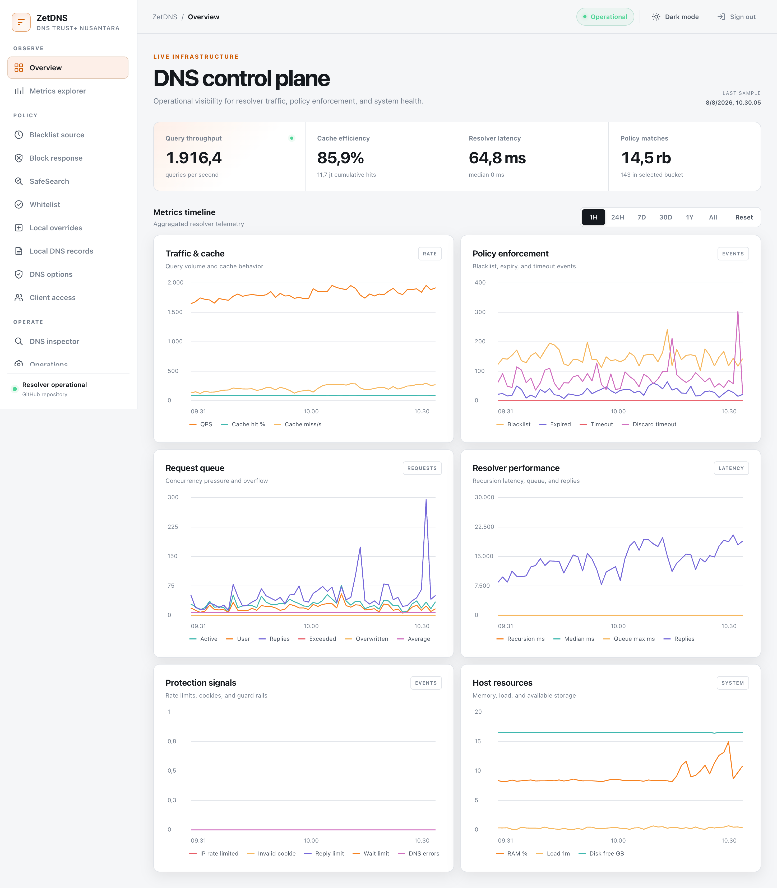
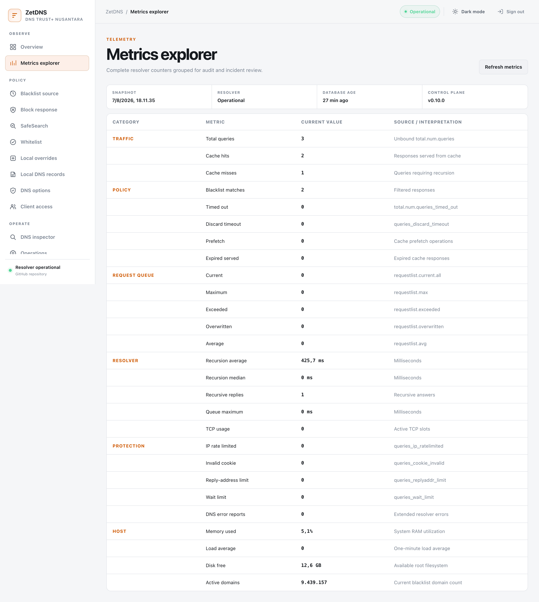
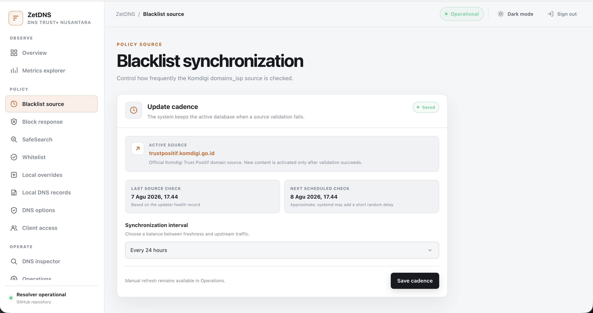
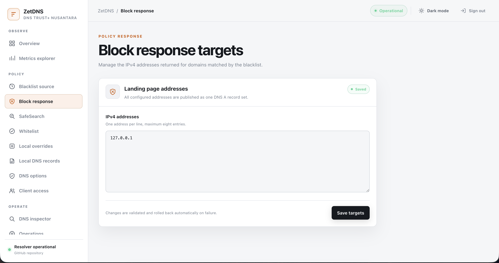
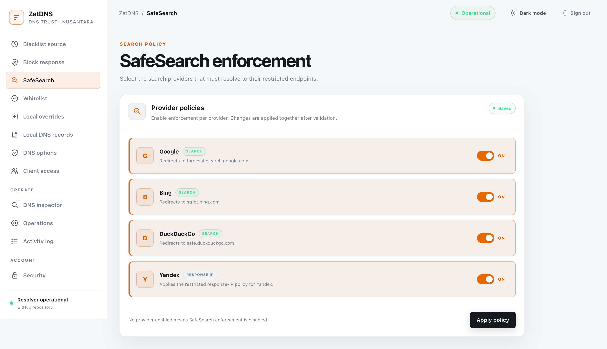
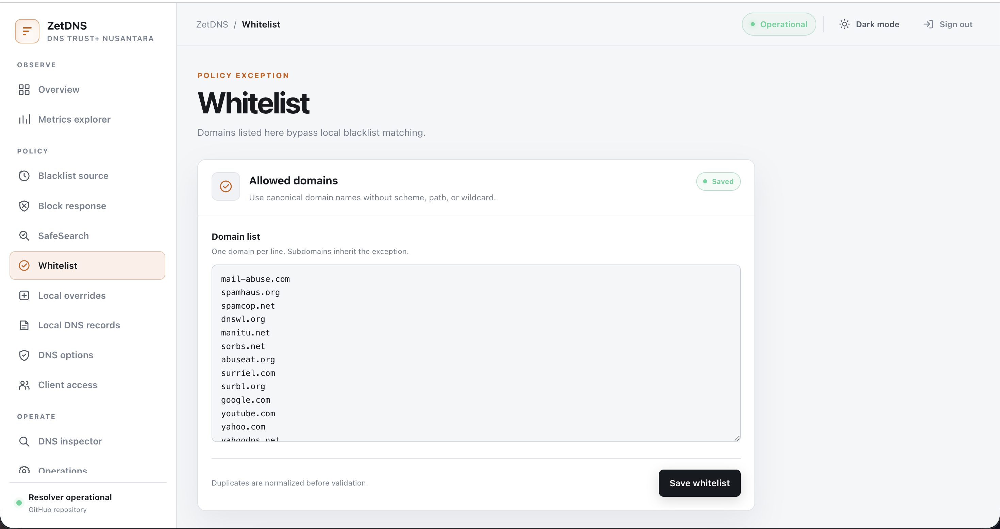
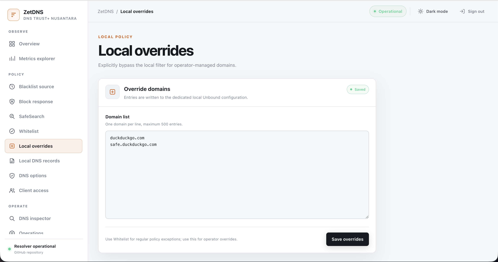
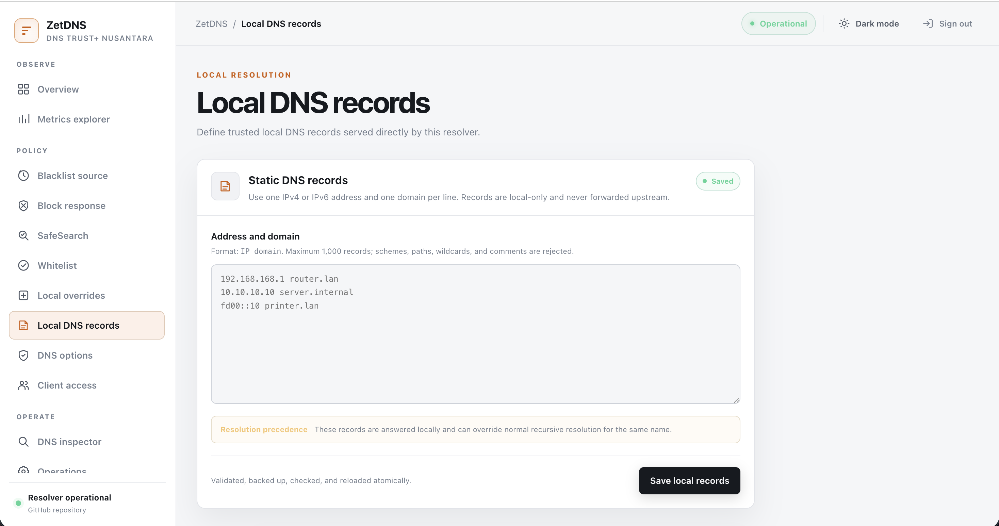
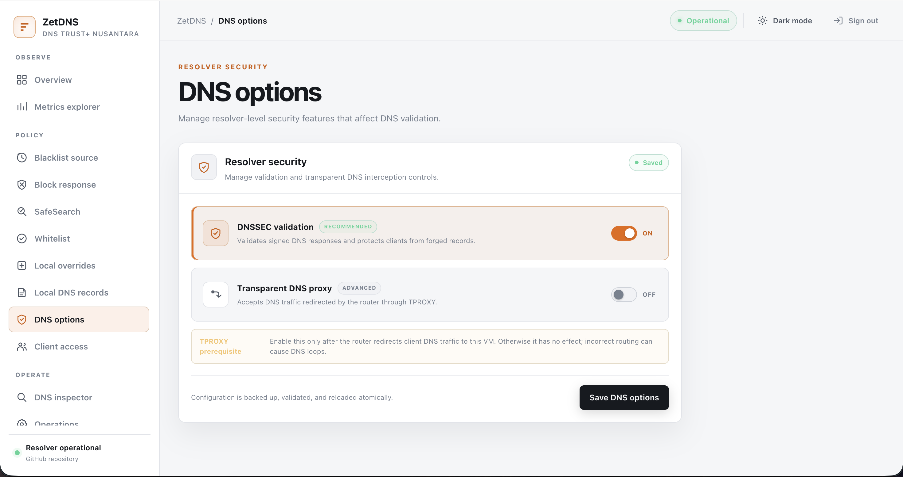
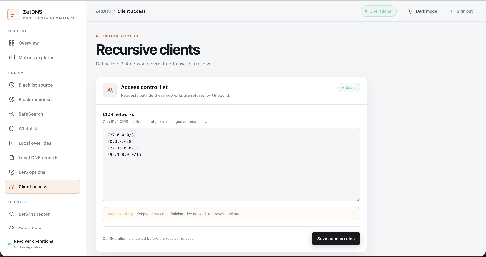
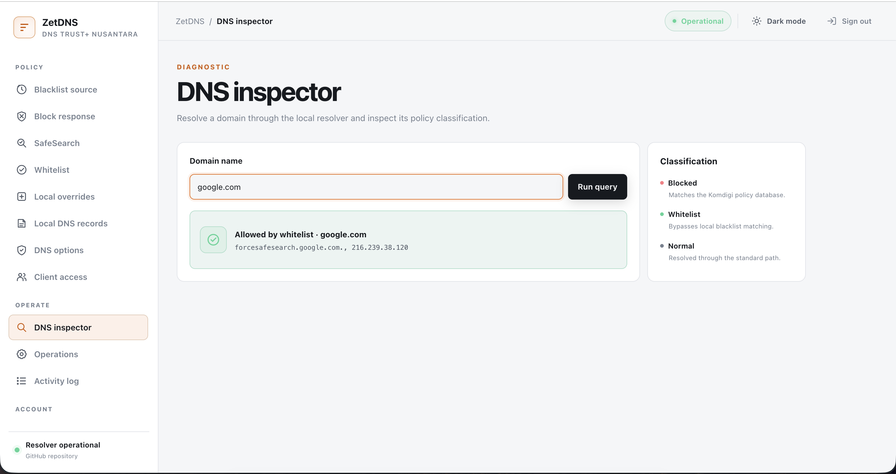
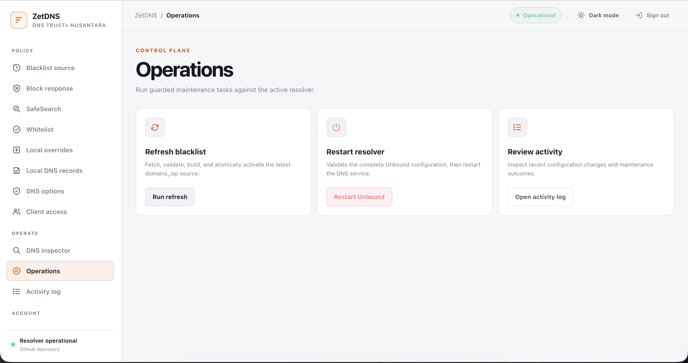
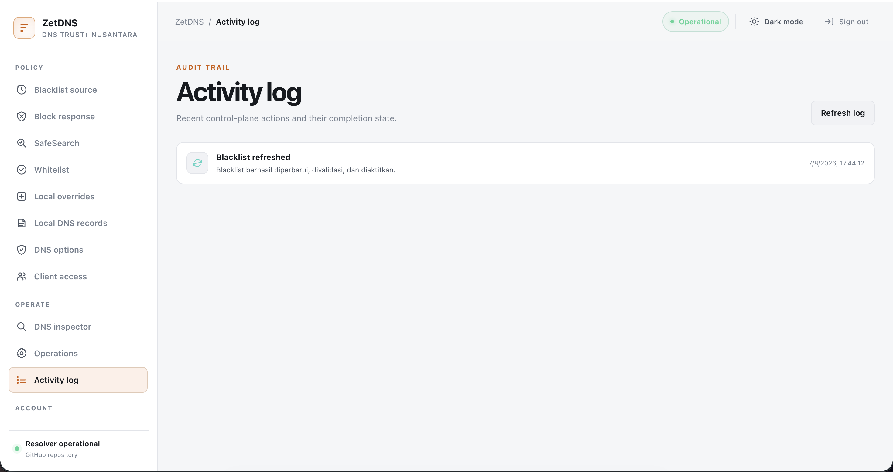
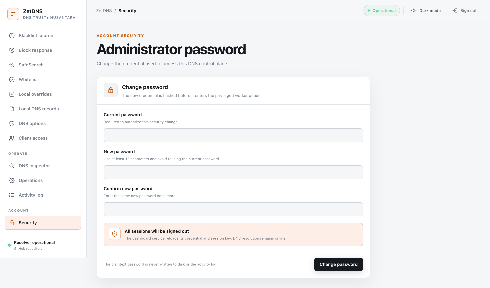


### Cek Apakah DNS Berjalan

Dari server:

```sh
systemctl is-active dnstrust-unbound
# hasil: active
```

### Status dan Layanan

| Perintah | Fungsi |
|---|---|
| `systemctl status dnstrust-unbound` | Status server DNS |
| `systemctl status dnstrust-admin` | Status dashboard |
| `systemctl status unbound-blacklist-update.timer` | Status pembaruan daftar blokir |
| `sudo /usr/local/sbin/dnstrust-admin reload` | Reload dashboard |
| `sudo /usr/local/sbin/dnstrust-admin reset-password` | Reset password dashbaord |

Daftar situs blokir diperbarui otomatis setiap 1 jam.

### Panduan Singkat nftables

Server dilindungi firewall **nftables**. Secara default hanya port berikut yang dibuka untuk jaringan privat (10/8, 172.16/12, 192.168/16):

| Port | Layanan |
|---|---|
| 53 | DNS (UDP & TCP) |
| 22 | SSH |
| 9080 | Dashboard |

#### Melihat aturan yang aktif

```sh
nft list ruleset
```

#### Menambah port yang diizinkan

File aturan ada di `/etc/nftables.conf`. Contoh membuka port 80:

1. Buka file:

   ```sh
   nano /etc/nftables.conf
   ```

2. Tambahkan baris di bagian `chain input` (di samping aturan `tcp dport 9080`):

   ```
   ip saddr @ssh_admins_v4 tcp dport 80 accept
   ```

3. Simpan, lalu terapkan:

   ```sh
   systemctl restart nftables
   ```

4. Cek apakah sudah aktif:

   ```sh
   nft list chain inet filter input
   ```

> Perhatian: aturan `policy drop` membuat semua koneksi lain ditolak. Pastikan port SSH (22) dan DNS (53) tidak dihapus dari file, dan selalu tes dari terminal lain sebelum meninggalkan sesi SSH.

## Cara Menghapus (Uninstall)

```sh
./uninstall.sh
```

Ketik `REMOVE DNS TRUST` saat diminta konfirmasi. Semua data lama di-backup ke `/var/backups/` sebelum dihapus.

## Tes Instalasi di Docker (Opsional)

Bisa dicoba dulu tanpa server fisik:

```sh
./test/docker/test.sh
```

Script ini menyalakan server uji, menjalankan instalasi, lalu memeriksa hasilnya secara otomatis.
